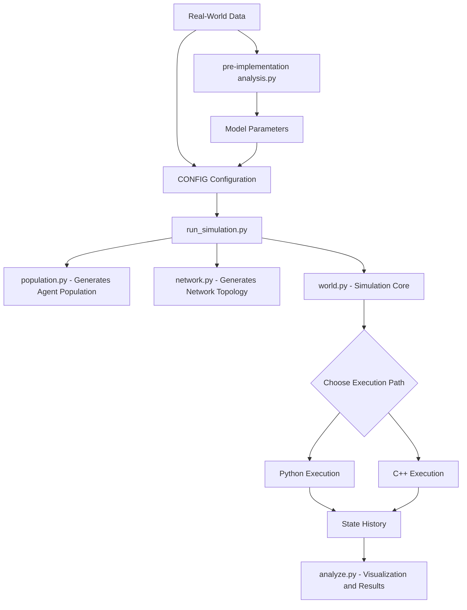

# Diffusioin Ceiling in High-Performance Agent-Based Modeling 

This is not just a simulation, but a scalable, high-performance computational framework for modeling information cascades in complex networks. This project tackles core computer science challenges in algorithmic efficiency, software architecture, and data-driven modeling to build a robust tool for studying emergent social phenomena.

The engine's architecture is designed to overcome the limitations of traditional models by integrating a **hybrid Python/C++ simulation core**, **procedural network generation**, an **object-oriented agent hierarchy**, and a **rigorous data-driven calibration pipeline**. It demonstrates how computational techniques can be applied to derive causal insights from complex systems.

## Objectives & Research Questions

Beyond its technical implementation, this project is a computational laboratory designed to answer fundamental questions about social dynamics that are difficult to study in the real world:

1.  **What are the limits of peer-to-peer influence?** Can simple "word-of-mouth" diffusion explain large-scale viral events, or are other mechanisms required?
2.  **How does network structure shape collective belief?** Specifically, how does social homophily (the tendency for people to connect with similar others) affect the spread of information and lead to phenomena like polarization?
3.  **Can we identify the causal mechanisms of virality?** By building a multi-mechanism model, can we isolate the specific contribution of influential "media" nodes versus organic, peer-to-peer sharing?

The goal was to create a "digital twin" of a social system—one that is complex enough to produce realistic emergent behavior but controlled enough to allow for causal experimentation.

## Key Emergent Findings & Insights

Through rigorous simulation and out-of-sample validation against real-world data, the `Herdless` engine uncovered several key properties of information cascades:

#### 1. The "Network Diffusion Ceiling"
The simulation consistently revealed that **peer-to-peer diffusion alone is insufficient to create large-scale viral cascades.** Information spreads locally but becomes trapped within community clusters, failing to bridge to the wider network. This saturation point, termed the "Network Diffusion Ceiling," is an emergent property of networked systems and explains why most information fails to go viral.

#### 2. Virality is a Two-Mechanism Phenomenon
The model's initial predictive failure (Phase 3) and subsequent success (Phase 4) provided strong causal evidence that viral cascades are a **two-phase process**.
*   **Phase 1: Peer-to-Peer Saturation:** The rumor spreads organically but quickly hits the Network Diffusion Ceiling.
*   **Phase 2: Broadcast Amplification:** Large-scale growth only occurs when high-reach "media nodes" broadcast the information, breaking the ceiling by re-seeding the rumor into disparate parts of the network. This was validated against the Higgs Boson data, where simulation accuracy dramatically improved only after event-driven broadcasts were integrated.

#### 3. Homophily Accelerates Polarization
The use of the Stochastic Block Model in `network.py` allowed for controlled experiments on network structure. The findings were clear:
*   In highly homophilic ("cliquey") networks, local cascades emerged much faster within communities.
*   However, this structure also created strong barriers to information flow *between* communities, leading to rapid and persistent belief polarization. This was quantitatively measured by the bimodality coefficient in `analyze.py`, which tracked the emergence of two distinct belief camps.

This project demonstrates that large-scale agent-based modeling is a powerful methodology for bridging computer science and social science. It provides a means to not just describe complex phenomena, but to test the causal mechanisms that generate them.

## Features

This project is fundamentally a computer science endeavor, focused on designing and implementing an efficient and scalable modeling system. Key features include:

*   **High-Performance Simulation Core (Python/C++ Hybrid):**
    *   The core simulation loop in `world.py` features a dual-path execution model. For maximum performance, it leverages a compiled C++ extension (`cpp_core`) to execute the computationally-intensive belief update calculations, bypassing Python's Global Interpreter Lock (GIL).
    *   The system includes a graceful fallback to a pure Python implementation if the C++ core is not available, ensuring portability and robustness. This hybrid strategy is a classic solution to performance bottlenecks in scientific computing.

*   **Algorithmic Efficiency with JIT Compilation:**
    *   Performance-critical Python functions, such as probability calculations in `network.py` (`compute_probabilities`) and S-curve analysis in `calibrate_model.py` (`get_simulated_s_curve_numba`), are accelerated using the **Numba `@njit` (Just-In-Time) decorator**.
    *   This technique compiles Python code to optimized machine code at runtime, achieving C-like speeds for numerical loops without leaving the Python ecosystem.

*   **Advanced Network Generation Algorithms:**
    *   The framework implements a **Stochastic Block Model (SBM)** in `network.py` to procedurally generate networks with homophily—a key feature of real-world social structures.
    *   This moves beyond simple random graphs to an algorithmic approach that allows for controlled experiments on network topology's effect on diffusion.

*   **Object-Oriented and Modular Architecture:**
    *   The system is designed with a clear separation of concerns, utilizing an **object-oriented paradigm**. A `BaseAgent` class defines a common interface, with multiple concrete implementations (`EmpiricalAgent`, `BoundedConfidenceAgent`) that encapsulate different behavioral models.
    *   The `World` class acts as a simulation manager, handling the main event loop, state logging, and agent interactions, while the `run` function in `api.py` provides a clean, high-level entry point, making the engine a reusable library.

*   **Automated Model Calibration and Validation:**
    *   The project includes a complete computational pipeline for **empirical validation** in `calibrate_model.py`. It implements a **grid search algorithm** to find optimal model parameters (`rumor_strength`, `homophily_strength`) by minimizing the Mean Squared Error (MSE) between simulated and real-world cascade data.
    *   This demonstrates a core methodology from machine learning and computational science: systematically tuning a model to fit empirical evidence.

*   **Data Engineering and Pre-Implementation Analysis:**
    *   The script `pre-implementation analysis.py` serves as a data engineering pipeline. It processes a large, raw social network dataset (`higgs-social_network.edgelist`) to derive key model parameters, such as the `empirical_broadcast_fraction`.
    *   This crucial step grounds the simulation in reality and showcases the ability to transform raw data into actionable model inputs.

## Project Architecture

The engine is architected as a modular pipeline, where each component addresses a specific computational task:



## Technical Deep Dive

#### 1. The C++/Python Hybrid Core

The primary performance bottleneck in an agent-based model is the main simulation loop, where every agent's belief is updated at every timestep. For a network of N agents with an average degree of K, this can approach O(N*K) operations per step.

The pure Python implementation in `world.py` is clear and readable:
```python
# world.py (Pure Python Path)
next_beliefs = {}
for agent in self.agents.values():
    neighbor_beliefs = agent.get_neighbor_beliefs()
    # ... computation ...
    next_beliefs[agent.id] = agent.compute_new_belief(...)

for agent_id, new_belief in next_beliefs.items():
    self.agents[agent_id].belief = new_belief
```
While simple, this loop is slow in Python. The optimized C++ path bundles the data (beliefs, parameters, network structure) and sends it to a compiled function for a single, high-speed computation:
```python
# world.py (C++ Optimized Path)
next_beliefs_list = chimera_cpp_core.calculate_next_beliefs(
    current_beliefs=current_beliefs,
    epsilons=epsilons,
    lambdas=lambdas,
    adj_list=adj_list,
    # ... other params
)
```
This is a powerful demonstration of using the right tool for the job: Python for high-level orchestration and C++ for raw numerical crunching.

#### 2. Numba for Targeted Optimization

Where a full C++ extension is unnecessary, we use Numba for targeted acceleration. The `compute_probabilities` function in the network generator involves several mathematical operations inside a loop. By adding a single decorator, we achieve significant speedups.

```python
# network.py
from numba import njit

@njit
def compute_probabilities(sizes, avg_degree, homophily_strength):
    """
    Compute intra- and inter-group edge probabilities using Numba for speed.
    """
    # ... pure numerical numpy/python code ...
    return p_in_c, p_in_f, p_out_avg
```

#### 3. Agent Design and Polymorphism

The agent architecture allows for flexible experimentation. The `World` populates itself based on a string identifier (`agent_type`), showcasing polymorphism. This makes it trivial to swap out different cognitive models without changing the core simulation logic.

```python
# world.py
# ... inside populate method ...
if agent_type == "linear":
    agent = LinearAgent(agent_id=node_id)
elif agent_type == "bounded":
    agent = BoundedConfidenceAgent(agent_id=node_id, epsilon=epsilon)
elif agent_type == "empirical":
    agent = EmpiricalAgent(...)
# ... etc.
self.agents[node_id] = agent
```
<!--
## How to Run the Simulation

**Prerequisites:**
*   Python 3.8+
*   Pip for package management

**1. Clone the repository:**
```bash
git clone <your-repository-url>
cd <repository-directory>
```

**2. Install dependencies:**
```bash
pip install -r requirements.txt
```
*(Note: You would need to create a `requirements.txt` file containing `networkx`, `numpy`, `pandas`, `numba`, `scipy`, `matplotlib`, `python-dotenv`)*

**3. Run a basic simulation:**
This script will generate a population and a homophilic network on the fly, run the simulation, and save the results.
```bash
python run_simulation.py
```
Outputs, including plots and data files, will be saved in the `results/` and `data/` directories.

**4. Calibrate the model against real data:**
This script runs a grid search to find the best-fitting parameters for the Higgs Boson dataset.
```bash
python calibrate_model.py
```

## Code Structure Overview

*   `Herdless/`: The main source code library.
    *   `__init__.py`: Makes the directory a Python package and exposes the public API.
    *   `api.py`: Provides the top-level `run()` function for easy library usage.
    *   `agent.py`: Defines the agent class hierarchy and their belief update logic.
    *   `world.py`: The core simulation engine, managing agents, time, and events. **Contains the C++ optimization path.**
    *   `network.py`: Functions for procedural network generation. **Contains Numba JIT optimization.**
    *   `population.py`: Generates heterogeneous agent populations from statistical distributions.
    *   `events.py`: Defines events that can occur in the simulation, like a `RumorEvent`.
*   `run_simulation.py`: An executable script to run a standard simulation with a given configuration.
*   `calibrate_model.py`: An executable script for running the parameter optimization pipeline against empirical data.
*   `pre-implementation analysis.py`: Data engineering script to extract parameters from raw data.
*   `analyze.py`: A script for post-simulation analysis and visualization.
-->
## Conclusion

Project Herdless is a comprehensive computer science project that addresses challenges in **high-performance computing, algorithmic design, software architecture, and data engineering**. By building a scalable and empirically-grounded simulation engine, it provides a powerful tool for scientific inquiry while demonstrating the practical application of core computer science principles to complex problems.
